author: Stephan Heuser, Priyam Biswas
summary: Fuzzing training 101
id: AFL_Training 
categories: afl++, crash analysis 
environments: Web
status: Draft
feedback link: https://github.com/intel-innersource/documentation.practices.security.fuzzing
analytics account: Google Analytics ID


# Introduction to Fuzzing
## Fuzzing with AFL++
### American Fuzzy Lop plus plus (AFL++)​
AFL++ is a fork of AFL with more features and options ​
### Features​
* A fuzzer with many mutators and configurations: afl-fuzz​
* Different source code instrumentation modules: multiple LLVM-based variants, GCC plugin​
* Different binary code instrumentation modules: QEMU mode, Unicorn mode, QBDI mode​
* Utilities for testcase/corpus minimization: afl-tmin, afl-cmin​
* Various helper libraries​
* Reference:[AFLplusplus](https://github.com/AFLplusplus/AFLplusplus) ; [aflplus.plus](https://aflplus.plus/) 
### AFL++ Operation​
1. Fork a new process (before main() is entered)​
1. Fork point can be modified to avoid costly initialization procedures [README](https://github.com/AFLplusplus/AFLplusplus/blob/stable/instrumentation/README.persistent_mode.md)​
1. Feed it an input modified by the mutation engine​
   + Different mutation algorithms are available ​
   + Custom mutator interface: [custom_mutators](https://aflplus.plus/docs/custom_mutators/​)
1. Monitor the coverage and notify afl-fuzz about any crashes/hangs​
1. Prefer inputs that create additional coverage for next iteration​
1. GOTO  1
### Fuzzing Harness
* Can be thought as an “entry point”​
* Accepts testcases from fuzzer and feeds them to the fuzzing target​
* Often based on existing testing/debug interfaces​
* Examples​:
  1. Network server-client program: Encapsulation of the server’s client interface that bypasses the actual network communication​
  1. Image processing library(libpng): A wrapper around an API in the target library that takes png formatted input and performs operations on it
### AFL++ specific aspects
* AFL++ is primarily a fuzzer for fuzzing instrumented binaries​
* Instrumentation is done at compile time​
* Target needs to be an executable binary, for which ideally the source code is available (easier instrumentation)​
  + Network server case: Do not use socket, but feed input to corresponding package parsing code​
  + Library case: Binary can internally call the API that needs to be fuzzed​
  + Firmware/embedded device case: ​
	- Emulation using unicorn​
	- Rehosting​
	- Custom instrumentation and feedback
### Example: Fuzzing an file format parser​
## AFL compiler wrappers​
* Try to always build a static binary, do not use dynamic linking if somehow possible!​
* Either modify your environment variables, or create a new target​
```
CC = clang => CC = afl-clang-fast ​
CFLAGS = … => CFLAGS = … -DFUZZING=1​
…
```
* ​or pass the compiler and and flags to your build system. E.g., ​
```
CC=afl-clang-fast CXX=afl-clang-fast++ ./configure --disable-shared​
```
### Reading input from stdin or files​
afl-fuzz expects the target to accept client input either via stdin​
```
./your_binary < /PATH/TO/YOUR/INPUT​
```
or via file​ : Filename is passed via command line arguments​
```
./your_binary /PATH/TO/YOUR/INPUT
```
### Instrumentation Options​
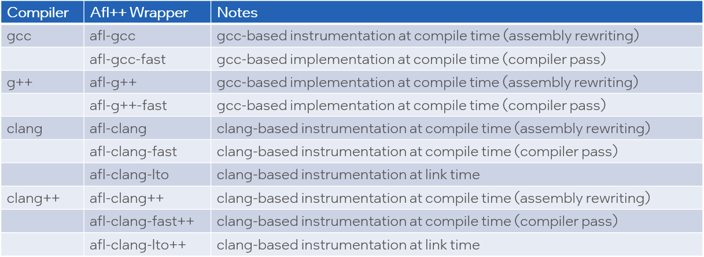

### Instrumentation BKMs​
* Prefer clang over gcc based instrumentation​
  + Choose afl-clang over afl-gcc​
* Prefer instrumation via compiler pass over assembly rewriting​
  + Choose afl-gcc-fast or afl-clang-fast over afl-gcc or afl-clang​
* Evaluate LTO based instrumentation​
  + Collision-free instrumentation due to global vison of target 

### A note on optimizations​
* afl compiler wrappers by default set –O3​
  + Agressive optimization to improve performance​
  + This may hide issues hidden in code that is optimized out​
    - Actually this in itself may hint at a problem in your code​
  + Suggestion to use the compiler optimization level of your production code​
  + You can also completely deactivate optimization by afl compiler wrappers using the AFL_DONT_OPTIMIZE environment variable​

```
AFL_DONT_OPTIMIZE = 1
```
### Fuzzing with AFL++​
Once your harness is ready, use afl-fuzz to fuzz it​. In this example we read input via stdin​
    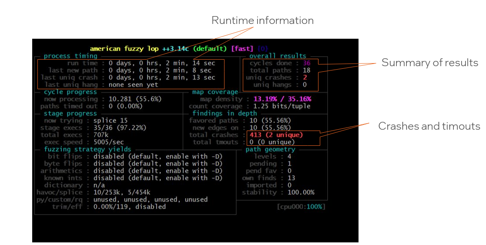
Once fuzzer is lauched, you will see the stats:
 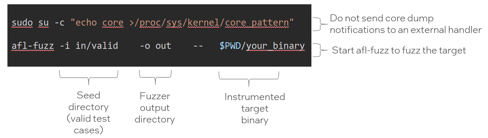
### AFL++ output folder
* afl++ output directory contents​
 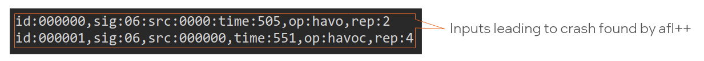
* Feeding afl++ findings into your target (in this case via stdin)​
```
./your_binary < ~/src/out/default/crashes/id:000000,sig:06:src:0000:time:505,op:havoc,rep2
```
​
* Use your standard debugging tools to dig deeper (e.g., gdb)​
- More details on bug triage in a follow-up training
### Scaling fuzzing with AFL++​
* Fuzzing with one afl++ instance is not sufficient​
  + afl++ is not multithreaded. Scale by synchronizing multiple afl++ instances​
  + afl++ instances are synchronized via the out folder ​
```
Master fuzzer process:​
$afl-fuzz –M master -i in/valid -o out -- $PWD/your_binary​

Slave processes:​
$afl-fuzz –S slaveNNN -i in/valid -o out -- $PWD/your_binary​
```
​
* Reference: [Fuzzing in depth](https://github.com/AFLplusplus/AFLplusplus/blob/stable/docs/fuzzing_in_depth.md#c-using-multiple-cores)

### Deferred Initialization​
* afl++ fork server forks before main(…) method is executed​
* This can be inefficient if there in case of  slow intialization code​
* Deferred Initialization provides manual control over fork server​
* Before using this study the following to learn about limitations​ (e.g., for NNN in 000 … 100) [README](https://github.com/AFLplusplus/AFLplusplus/blob/stable/instrumentation/README.persistent_mode.md)
```
// … costly initialization code …​
#ifdef __AFL_HAVE_MANUAL_CONTROL​

  __AFL_INIT(); # AFL will start forking the process here​

#endif
```
### Persistent Mode
* Forking is an expensive and slow operation​
* Persistant mode allows feeding multiple inputs into one forked target in a serial fashion ​
  + Note that input may effect the state of your program ​
  + You may have to manually reset the state of your target program between invocations​
* Beyond fuzzing in parallel this is the main scaling mechanism of afl++. Use it! 
* Reference: [README](https://github.com/AFLplusplus/AFLplusplus/blob/stable/instrumentation/README.persistent_mode.md)
### Outlook
* afl++ can and should be used with Sanitizers for more efficient bug hunting​
* Coverage analysis is a useful tool to identify roadblocks for afl++​
* More advanced topics are discussed in the afl++ documentation
* Reference: [Fuzzing in Depth](https://github.com/AFLplusplus/AFLplusplus/blob/stable/docs/fuzzing_in_depth.md)

## Introduction to Sanitizers
* A dynamic analysis tool to detect low level violations​
  + For example:  memory safety/type safety violations​
* Doesn’t aim for program properties​
* Popular Sanitizers: Address Sanitizer, Undefined Behavior Sanitizer etc.​
* AFL++ can be paired with different sanitizers to enhance crash-detection capability
### AddressSanitizer (aka ASan)​
* Detects memory errors by placing red zones​
* Typical slowdown is 2x​
* Flag: -fsanitize=address​
* Can detect​
  + Out-of-bounds accesses to heap, stack and globals​
  + Use-after-free​
  + Use-after-return ​
  + Use-after-scope ​
  + Double-free, invalid free​
* Can use massive amounts of memory​
  + Use –m32 compiler flag to compile 32-bit version of target if possible!
**stack-buffer overflow**
```
int main(in argc, char **argv) {​
       int buffer[20];​
       buffer[1] = 0;​
       return buffer[argc+20];​
}
```
```
% clang –fsanitize=address ./stack_overflow.
```
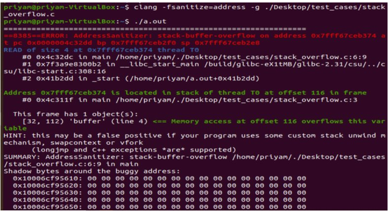

### MemorySanitizer (aka MSan)​
* Detects uninitialized reads​
* Tags memory allocations and flags uninitialized reads ​
* Slowdown is around 3x​
* Only supported in 64 bit mode​
* Flag: -fsanitize=memory

```
#define SIZE 20​
int main(int argc, char** argv) {​

  int* a = malloc(SIZE);​

  a[5] = 0;​

  if (a[argc])​

    printf("xx\n");​

  return 0;​

}​
```
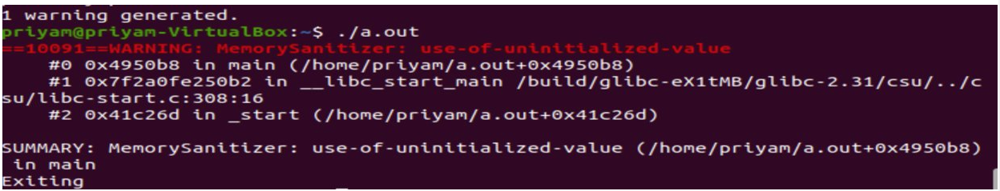
### Undefined Behavior Sanitizer (aka UBSan)​
* Detects typical undefined behavior in C/C++ programs​
* Slowdown usually depends on the number of checks​
* Flag: -fsanitize=undefined​
* Detects errors such as​
 + Using misaligned or null pointer​
 + Signed integer overflow​
 + Conversion to, from, or between floating-point types which would overflow the destination

```
 int main(int argc, char **argv) {​

  int k = 0x7fffffff;​

  k += argc;​

  return 0;​

}
```
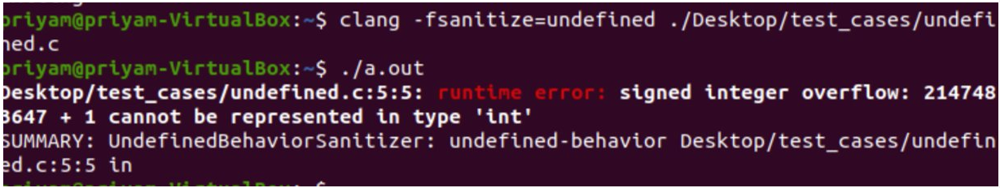

### Leak Sanitizer
* Detects run-time memory leaks​
* No performance overhead until the very end of the process​
* Flag: -fsanitize=leak
```
void *p;​

int main() {​

  p = malloc(7);​

  p = 0; ​

  return 0;​

}
```
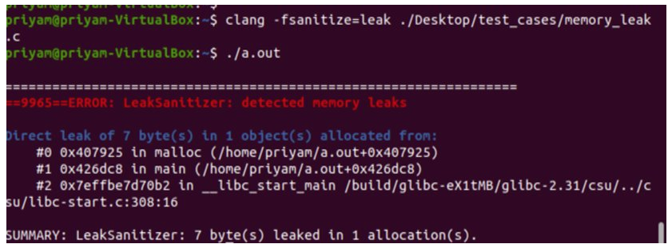

## AFL++ and Sanitizers
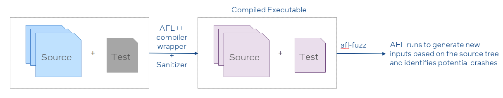
* Activate sanitizers via environment variable when compiling​
* We recommend to not use multiple sanitizers in one fuzzer instance since it may cause the fuzzer to miss issues​
* When fuzzing in parallel, you can and should use different sanitizers on different afl++ instances​
* Reference: [c-sanitizers](https://github.com/AFLplusplus/AFLplusplus#c-sanitizers​)
### AFL++ and Sanitizers – what works well
**Automation**​
* It is fast, efficient, effective​
* Easier to verify bug fixes (just re-run the test with the input that caused a crash)​

**Certain types of code lend themselves well to such analysis ​**
* Parsers: network packets, files, user input​
* Servers: with transformation to take input from a file rather than a network socket​
* Libraries: cryptography utilities, string utilities, file-manipulation utilities, data encoding utilities​
### AFL++ and Sanitizers - Limitations
* Does not catch direct logical/semantic errors ​
  + Reading the wrong bit in a register, wrong branching in code​
* Long execution time​
  + For effective coverage, depending on code depth, needs to run for a long time.​
  + Can be mitigated by parallelization and limiting scope​
* Does not catch ‘All’ buffer errors​
  + AFL attempts to hit every branch of code​
  + When a branch is hit, even if a bug exists, a crash only occurs if AFL uses the correct (malformed) input​
  
​
```
Input: buffer (variable length: 1-10)​
msg_id = buffer[0]​
if (msg_id == 1)​
            temp = buf[5]​     ----> //When AFL hits this branch, it should use an input that is lesser than 6 bytes long to trigger a crash. But this may not always be the case.
else if (msg_id == 2)​
                 temp = buf[9]​
else if (msg_id == 3)​
                 temp = buf[1]
```
## Bug Triage
### Ways to triage Bugs
  + Trace collection of crashes
  + Crash statistics

### Example: Stack Buffer Overflow
  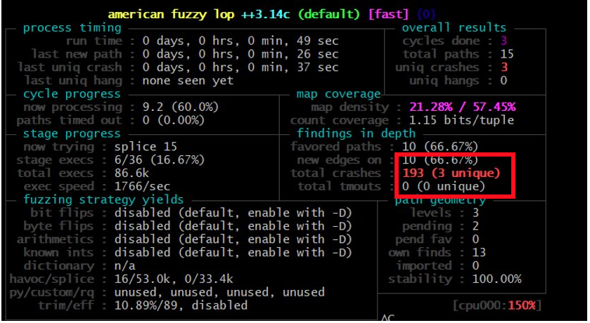
  **Output directory**:​ Contains information specific to crashes and interesting inputs
  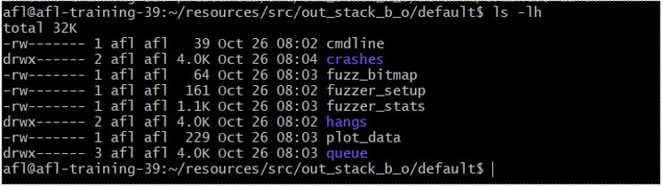
  **Crashes**: Number of unique crashes plus an auto-generated README.txt file 
  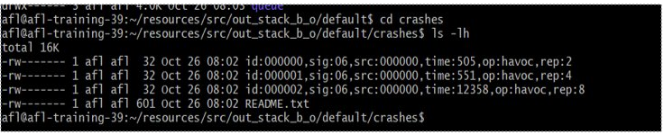
  **Fuzzer_stats**
  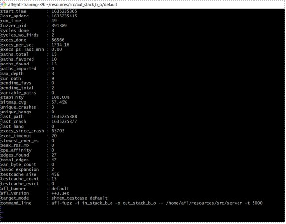
  
### Reproducing the crashes
```
$$ gdb ./server​

$$ r < id:000000,sig:06,src:000000,time:505,op:havoc,rep:2​
```
​   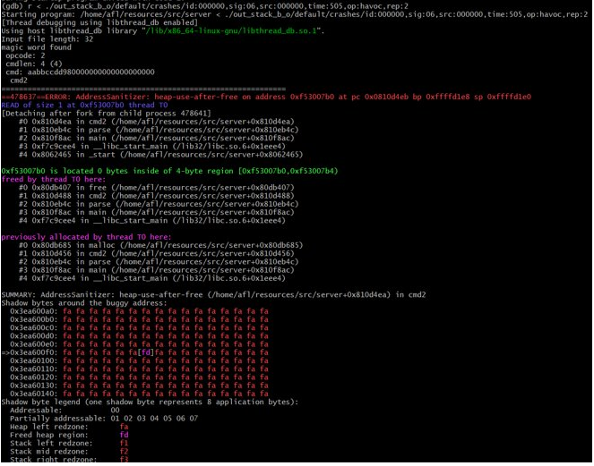

## Coverage Analysis​
**Coverage**: Measurement of code segments explored by the fuzzing mechanism​
* Widely used as part of software testing to discover untested code segment​
* This information is used to make informed decisions about which inputs to mutate
**Intuition: A software flaw is only detected if the flawed statement is executed. Effectiveness of test suite therefore depends on how many statements are executed**
* How can we that ensure we have tested a function/code segment “enough”?​
* We need a metric to establish the ground truth​
* Coverage helps us to establish that truth​

### How to Collect Coverage 
* Several tools are available​
  + [gcov](https://gcc.gnu.org/onlinedocs/gcc/Gcov.html) ​
  + [SanitizerCoverage](https://clang.llvm.org/docs/SourceBasedCodeCoverage.html​)
  + [afl-cov](https://github.com/vanhauser-thc/afl-cov​)
* For afl++-based fuzzing afl-cov is the most interesting one

### afl-cov in practice
* Compile a copy of the target with coverage collection enabled​
```
$ LDFLAGS="-lgcov --coverage" afl-clang-fast -fprofile-arcs -ftest-coverage -DFUZZING=1 ​your_program.c –o your_binary.cov​
```

* Run afl-cov.sh script afl-cov on output from fuzzing campaign​
```
$ afl-cov.sh -c out/ "./your_binary.cov < @@"​
```

* In this example input is expected via stdin. @@ will be replaced with the input vectors​
* afl-cov.sh will feed the input vectors into the binary and collect coverage information​

### afl-cov in practice​
* afl-cov will generate a standard lcov report​

* This gives an indication about areas that have not been explored by the afl++​

* Helps to identify fuzzing roadblocks
 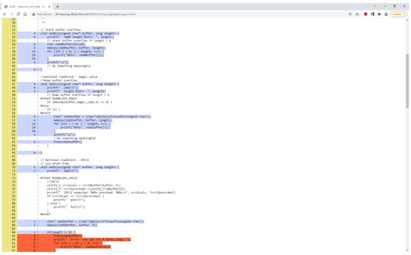
 
## Accessing IPAS Lab Environment 
### Setup
Use a recent browser to go to:​
[https://ipas-osr-lab.jf.intel.com/​](https://ipas-osr-lab.jf.intel.com/​)

Please login with the username and password provided to you.​

If your connection gets dropped just reopen the page again and you should be dropped into the same session.​
 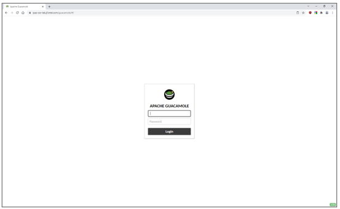
​
### Enable copy/paste
* Enable clipboard access in your browser to be able to copy/paste from / to your local machine​
* ​Copy and paste works like you would expect on a Linux machine​
  + Press and hold left mouse button to select text​
  + Press right mouse button to paste
 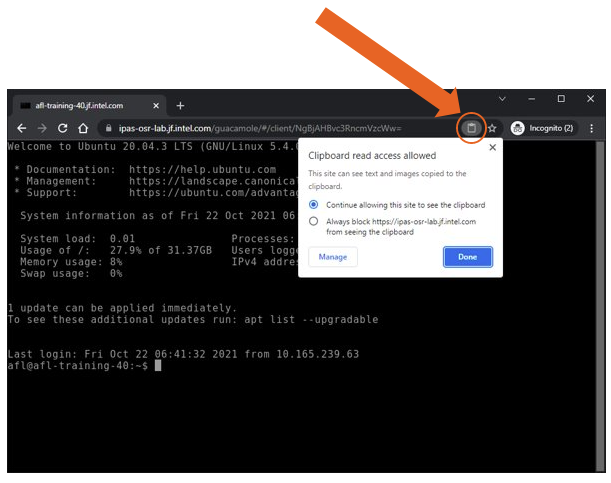
### Logging in
You will be dropped into a bash shell on your dedicated environment. This is a Ubuntu 20.04 VM which we can export to you after the training if needed. ​

Note: This machine has Internet access via proxy-dmz.intel.com.​

​**DISCLAIMER: DO NOT STORE OR ACCESS ANY INTEL TOP SECRET MATERIAL ON THIS VM IN THIS ENVIRONMENT!**

 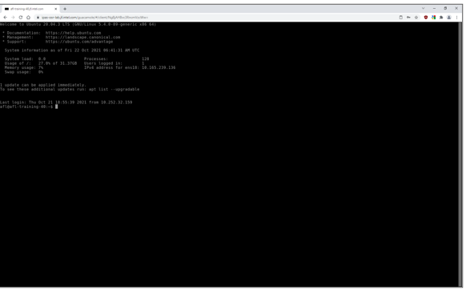

### Toggle screens
Use <CTRL>+<ALT>+<SHIFT> to toggle the remote access settings. Here you can increase the font size if needed.​

Note that your browser may capture some common keyboard shortcuts, such as CTRL-W (close browser tab / search in nano editor). 
 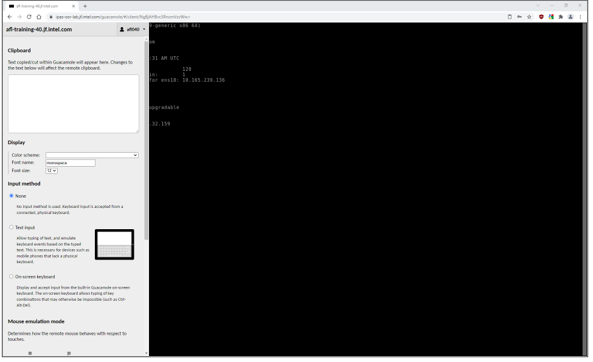

### Deployed software and exercises
* You should not need to install any additional software.​
* Common preinstalled editors:​
  + vi(m)​
  + emacs​
  + nano – note that ctrl-w closes the browser tab!​
  + hexcurse (F1 for help)​
* Training exercises are in the src directory in your home directory​
* Solutions for the exercises are available in the src/exercises folder. Please try to solve the exercises without looking at the solutions first.
## Accessing OneCloud Lab Environment 

## AFL++ Fuzzing Exercise
### Target: Simple network server
* Code is deployed in the **/home/afl/src** directory​
* Network server: **fuzzingtarget.c** is the network server​
* Client: **client.c** is the network client​
* Useful common logic: **common.c​**
* Example valid and invalid input in **src/in** directory​
* Makefile for GNU make​
​Note: The target contains some code that is disabled via #ifdefs (e.g., CRC32 input checking). Please ignore this for this for now!

### Input Structure
* Fixed 32 byte input expected from client​

* Command Handlers for different commands ​
  + Command 0…4 are supported​
  + Functions cmd0(…) … cmd4(…)​
* No „real program logic“ implemented, only some potential vulnerabilities in the cmd0(…) … cmd4(…) command handlers
### Task: Server reading input from stdin​
* Client reads input from stdin, server from network socket​
* Valid inputs are provided in the src/in/valid directory
```
./client < in/valid/INPUT_VECTOR
```
Modify the server to read input for the parse(…) method from stdin instead of from a network socket. Reuse the client codebase. When done, you should be able to call the server like this:

```
./server < in/valid/INPUT_VECTOR
```

### Task: Compile server with afl-clang-fast instead of clang​
* Use and extend the provided Makefile​
  + You can use the **server** target as a template to define a **server-afl** target​
* Use the **afl-clang-fast** compiler wrapper instead of **clang​**
  + LTO based implementation (afl-clang-lto) seems a little unstable​
* Note: set the following **environment variable** when compiling. This is needed since the afl++ compiler wrappers set –O3 by default which can lead to false negatives!​
```
AFL_DONT_OPTIMIZE = 1
```

### Task: Run afl-fuzz to fuzz the server
* Once your harness is ready, use afl-fuzz to fuzz it​
* Read input via stdin! See client code.
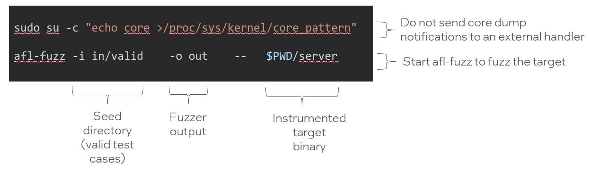

### Solution
* Please try to solve the exercise yourself​
* If you are stuck, ask for help and/or take a look at the solution provided in **/home/afl/src/solution**

## AFL++ Fuzzing (with Sanitizers) Exercise 
### Task: Compile with sanitizers enabled​
* When using AFL++ compiler wrappers sanitizers are enabled via environment variables​
  + This replaces explicit the –fsanitize=… compiler option​
  + Don‘t forget to use –m32 compiler option!
```
# Enable Address Sanitizer​
AFL_USE_ASAN=1 AFL_DONT_OPTIMIZE=1 afl-clang-fast –m32 ...​
# Enable Undefined Behavior Sanitizer​
AFL_USE_UBSAN=1 AFL_DONT_OPTIMIZE=1 afl-clang-fast –m32 ... ​
# Enable Leak Sanitizer​
AFL_USE_LSAN=1 AFL_DONT_OPTIMIZE=1 afl-clang-fast –m32 ...​
...
```
### Example for afl with ASAN
```
# Enable Address Sanitizer​
AFL_USE_ASAN=1 AFL_DONT_OPTIMIZE=1 afl-clang-fast -Wall -DFUZZING=1 -m32  fuzzingtarget.c ErriezCRC32.c common.c -o server​

# Start fuzzing​
afl-fuzz -i in/valid -o out -- $PWD/server
```
### Task: Compile with sanitizers enabled
* Do not use multiple sanitizers on one target and afl-fuzz instance​
* When fuzzing in parallel with multiple afl-fuzz instances you can (and should) run multiple instances with different sanitizers​
* Modify the Makefile to create one ore more of the following targets​
  + **afl-fuzz-asan** – for creating a target instrumented with ASAN​
  + **afl-fuzz-ubsan** – for creating a target instrumented with UBSAN​
  + **afl-fuzz-lsan** – for creating a target instrumented with LSAN​
* Compile the target(s)​
* Run afl-fuzz as outlined before on one of the targets​
* Collect crash information
### Task: Collect crash information
* After running afl for a few minutes afl++ should start collecting crashes​
* When crashes / sanitizer notifications are observed they are captured in src/out/default/crashes​
* Manually feed the output in src/out/default/crashes into the instrumented server
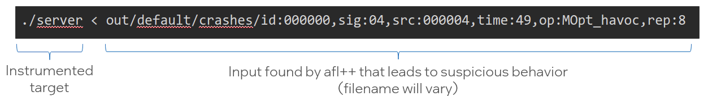

### Task: Analyze crashes
Example: Output from UBSAN instrumented binary
```
./server < out/default/crashes/id:000000,sig:04,src:000004,time:49,op:MOpt_havoc,rep:8

Output:
Input file length: 32​
magic word found​
 opcode: 0​
 cmdlen: b (11)​
 cmd: aabb29dd003400ffffff35064000000000​
 cmd0 length 11​
fuzzingtarget.c:39:24: runtime error: index 4 out of bounds for type 'char [4]'​
SUMMARY: UndefinedBehaviorSanitizer: undefined-behavior fuzzingtarget.c:39:24 in aabb29dd003400ffff
```
### afl-cov in practice
* Output will be created in  out/default/cov/web/​
  + Open in browser or expose via webserver (e.g., using python http.server)​
  + Use your server‘s hostname to figure out the URL to access the web interface:
```
python3 -m http.server --directory out/default/cov/web/
```
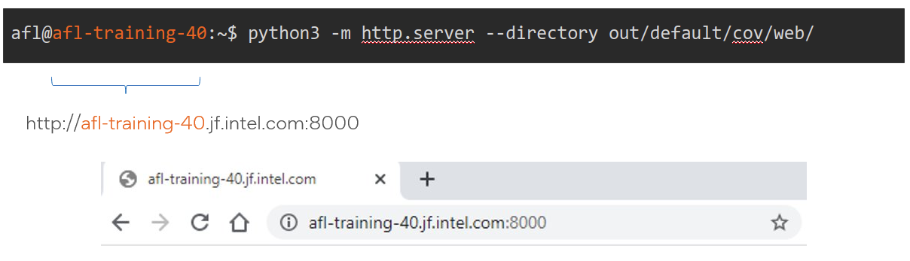

